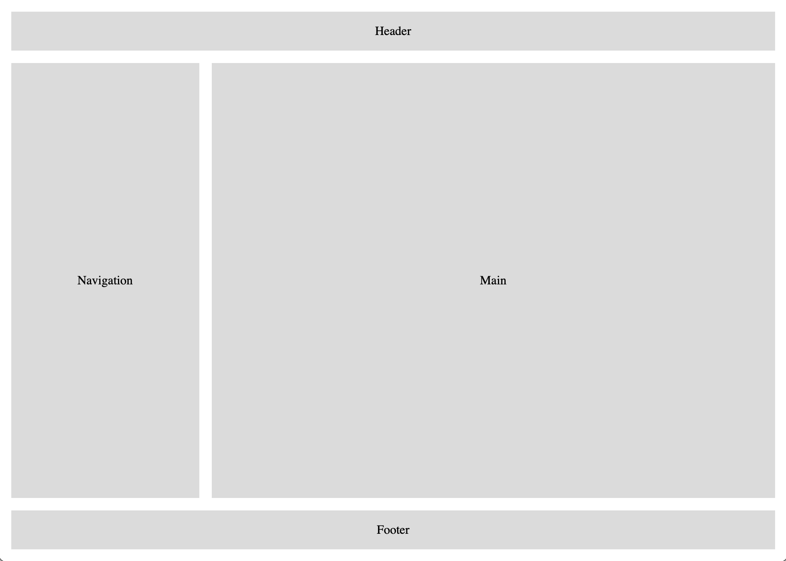

# Exercice : Grilles

Pour cet exercice, on vous demande de réaliser la mise en page ci-dessus
à l'aide d'une grille CSS. La taille des éléments doit s'adapter à la
taille de la fenêtre du navigateur, et le pied-de-page doit toujours se
trouver au bas de la page.
