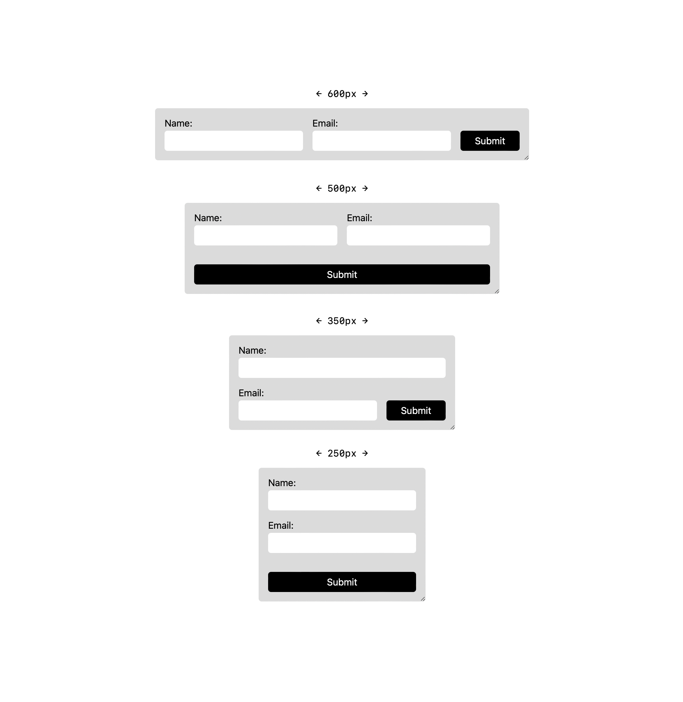

# Exercice : Flexbox

Pour cet exercice, il vous est demandé d'intégrer le formulaire
ci-bas à l'aide de la méthode de mise en page Flexbox. La largeur
idéal des champs doit être de 200px, et, lorsque possible, le bouton
doit prendre 1/3 de l'espace disponible.

