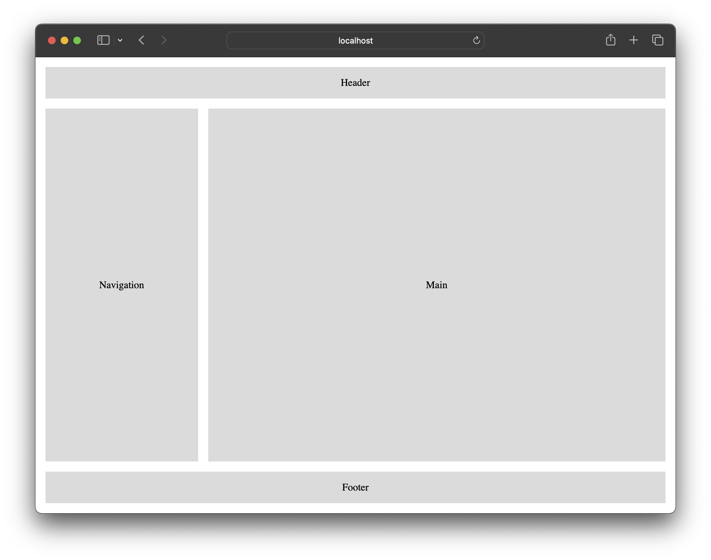

# Exercice : CSS Grid

Pour cet exercice, il vous est demandé de réaliser la mise en
page ci-bas à l'aide de CSS Grid. La taille des éléments doit
s'adapter à la taille de la fenêtre du navigateur, et le *footer*
doit toujours se trouver au bas de la page.

